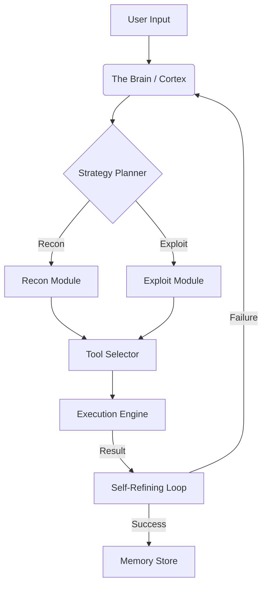

<div align="center">

# 🐉 DRAKBEN V2
### The Sentinel of Autonomous Cyber Warfare

```
██████╗ ██████╗  █████╗ ██╗  ██╗██████╗ ███████╗███╗   ██╗
██╔══██╗██╔══██╗██╔══██╗██║ ██╔╝██╔══██╗██╔════╝████╗  ██║
██║  ██║██████╔╝███████║█████╔╝ ██████╔╝█████╗  ██╔██╗ ██║
██║  ██║██╔══██╗██╔══██║██╔═██╗ ██╔══██╗██╔══╝  ██║╚██╗██║
██████╔╝██║  ██║██║  ██║██║  ██╗██████╔╝███████╗██║ ╚████║
╚═════╝ ╚═╝  ╚═╝╚═╝  ╚═╝╚═╝  ╚═╝╚═════╝ ╚══════╝╚═╝  ╚═══╝
```

***"Evolution is not an option, it's a necessity."***

[](https://github.com/ahmetdrak/drakben/actions)
[](https://github.com/ahmetdrak/drakben/blob/main/SUPREME_AUDIT_REPORT.md)
[](https://www.python.org/)
[](LICENSE)
[](Dockerfile)

[Report Bug](https://github.com/ahmetdrak/drakben/issues) · [Request Feature](https://github.com/ahmetdrak/drakben/issues)

</div>

---

## 👁️ What is Drakben?

**Drakben** is a bio-mimetic, autonomous offensive security agent. It doesn't just run tools; it **thinks**, **plans**, and **learns**. 

Unlike traditional scanners that blindly fire scripts, Drakben uses a **Self-Refining Engine** to analyze target responses in real-time. If an exploit fails, it understands *why* and modifies its approach—just like a human red teamer, but at machine speed.

> **⚠️ Status:** **Production Ready (V2.0)** - Verified by [Supreme Audit Protocol](SUPREME_AUDIT_REPORT.md).

---

## 🔥 Key Capabilities

| Feature | Description | Status |
| :--- | :--- | :--- |
| **🧠 Cognitive Core** | Powered by extensive LLM reasoning to navigate complex networks. | ✅ Active |
| **🧬 Self-Healing** | Automatically detects failures and switches strategies instantly. | ✅ Active |
| **🛡️ Zero-Assumption** | Every line of code is statically and dynamically audited. | ✅ Verified |
| **💀 Chaos Tested** | Survived 1000+ iteration fuzzing & memory leak stress tests. | ✅ Verified |
| **🔌 Universal Adapter** | Seamlessly integrates Nmap, Nikto, Nuclei, and custom exploits. | ✅ Active |

---

## ⚡ Quick Start

### Option 1: Docker (Recommended)
The fastest way to deploy Drakben without dependency hell.

```bash
docker build -t drakben .
docker run -it drakben
```

### Option 2: Manual Installation
For developers who want to tinker with the source code.

```bash
git clone https://github.com/ahmetdrak/drakben.git
cd drakben
pip install -r requirements.txt
python drakben.py
```

---

## 🎮 Usage Examples

Drakben understands **Natural Language Constraints**. You interact with it as you would with a colleague.

**Scenario 1: Reconnaissance**
> "Map the network 192.168.1.0/24 but stay stealthy. Do not trigger IDS."

**Scenario 2: Web Analysis**
> "Analyze example.com for SQL Injection vulnerabilities on the login page. If valid, try to bypass WAF."

**Scenario 3: Full Engagement**
> "Perform a full red team assessment on target.com. Report critical findings only."

---

## 📂 System Architecture



- **The Brain:** High-level decision making.
- **The Spine:** Robust execution engine with `shell=False` security.
- **The Memory:** Persistent SQL storage for long-term learning.

---

## 📜 Audit & Verification

This project adheres to the **"Zero Assumption"** philosophy.
- **Security:** Verified by Bandit & Custom Fuzzing.
- **Stability:** Confirmed via Chaos Engineering scripts.
- **Logic:** Validated by Mypy & Radon Complexity Analysis.

> Read the full [VERIFICATION REPORT](VERIFICATION_REPORT.md) or [SUPREME AUDIT REPORT](SUPREME_AUDIT_REPORT.md).

---

## 🤝 Contributing

Contributions are what make the open source community such an amazing place to learn, inspire, and create. Any contributions you make are **greatly appreciated**.

1. Fork the Project
2. Create your Feature Branch (`git checkout -b feature/AmazingFeature`)
3. Commit your Changes (`git commit -m 'Add some AmazingFeature'`)
4. Push to the Branch (`git push origin feature/AmazingFeature`)
5. Open a Pull Request

---

## ⚖️ Disclaimer

**Drakben is a specialized tool for authorization security auditing.**
The developers are not responsible for any damage caused by the misuse of this software. By using Drakben, you agree to use it only on systems you own or have explicit permission to test.

---

<div align="center">
    <b>Made with 🩸 sweat and 💻 code by the Drakben Team</b>
</div>
