<div align="center">

# 🧛 DRAKBEN V2
### The Autonomous A.I. Offensive Security Agent


**Drakben is not a scanner. It is an intelligent, self-evolving operator.**
<br/>
It bridges the gap between human expertise and machine speed by autonomously planning, executing, and refining offensive security operations.

[Features](#-capabilities) • [Installation](#-quick-start) • [Usage](#-usage) • [Architecture](#-evolutionary-architecture)

</div>

---

## ⚡ Quick Demo

Without memorizing complex flags, simply tell Drakben what you want to do.

```console
user@drakben:~$ ./drakben

[?] What is your objective?
> Scan target 10.10.11.23, stay stealthy, and if you find a website, look for SQL injection.

[+] 🧠 SELF-REFINING ENGINE
    └── Strategy Selected: STEALTH (Profile: Ghost_V2)
    └── Policy Loaded: "Avoid WAF triggers", "Rate Limit: Low"

[+] 👻 GHOST PROTOCOL
    └── Rotating User-Agent...
    └── Establishing Tor Circuit... [OK]

[+] 🕵️ RECONNAISSANCE
    └── Target: 10.10.11.23
    └── Open Ports: 80 (HTTP), 22 (SSH)
    └── Service: Apache 2.4.41

[+] ⚔️ ATTACK VECTOR
    └── Analyzing HTTP (Port 80)...
    └── Vulnerability Found: SQL Injection in /login.php
    └── Generating Polymorphic Exploit... [DONE]

[?] Critical vulnerability confirmed. Proceed with exploitation? (y/n)
> y
```

---

## 🚀 Capabilities

### 🧠 Core Intelligence
| Feature | Description | State |
| :--- | :--- | :---: |
| **Self-Refining Mind** | Learns from failures. If a tool fails, it pivots strategy & creates policies. | ✅ |
| **Singularity Engine** | Writes its own Python exploits on the fly when tools fail. | ✅ |
| **Evolution Memory** | Persists learned strategies and success/failure patterns across restarts. | ✅ |
| **Symbolic Reasoning** | Uses `z3-solver` for mathematical path analysis of vulnerabilities. | ✅ |

### ⚔️ Offensive Modules
| Feature | Description | State |
| :--- | :--- | :---: |
| **Ghost Protocol** | AST-Polymorphic code generation (Variable renaming, Dead code injection). | ✅ |
| **Weapon Foundry** | Generates encrypted payloads (AES/ChaCha20) in (exe, elf, ps1). | ✅ |
| **Hive Mind** | Native Active Directory attacks (Kerberoasting, SMB Spray, Bloodhound). | ✅ |
| **Web Recon** | WAF Detection, Fuzzing, SQLi/XSS Automation. | ✅ |
| **OSINT Spider** | Harvests emails & employees from public sources (LinkedIn/Google Dorks). | ✅ |
| **Post-Exploit** | Auto-Looting (Triage), Linux/Windows PrivEsc checks, Container Breakout. | ✅ |

### 🛡️ Evasion & Defense
| Feature | Description | State |
| :--- | :--- | :---: |
| **WAF Evasion** | Polymorphic SQLi/XSS payloads (Hex encoding, Whitespace randomization). | ✅ |
| **Anti-Forensics** | DoD 5220.22-M Secure Delete & Timestomping (File timestamp manipulation). | ✅ |
| **Universal Adapter** | Hides C2 traffic via **Domain Fronting** and DNS Tunneling. | ✅ |
| **Memory-Only** | Executes Python payloads directly in RAM without touching the disk. | ✅ |

---

## 🧬 Evolutionary Architecture

Drakben's core is designed to mimic a biological evolution process. It doesn't just run scripts; it **adapts**.

```mermaid
graph TD
    User-->|Natural Language| Adapter[Universal Adapter]
    Adapter -->|Intent| Brain[🧠 Self-Refining Brain]
    
    subgraph "Evolution Cycle"
    Brain -->|Plan| Singularity[🌌 Singularity CodeGen]
    Brain -->|Strategy| Hive[🕸️ Hive Mind]
    Singularity -->|Polymorphism| Ghost[👻 Ghost Protocol]
    Ghost -->|Obfuscation| Weapon[⚔️ Weapon Foundry]
    end
    
    Weapon -->|Attack| Target((Target System))
    Target -->|Feedback| Memory[Evolution Memory]
    Memory -->|Learning| Brain
```



---

## � Quick Start

### 🐳 Docker (Recommended)

The safest and fastest way to run Drakben.

```bash
# 1. Build the image
docker build -t drakben/core .

# 2. Run the agent (Host networking required for Nmap/Arp)
docker run -it --network host drakben/core
```

### 🐍 Manual Installation

```bash
# 1. Clone
git clone https://github.com/ahmetdrak/drakben.git
cd drakben

# 2. Install
pip install -r requirements.txt

# 3. Configure (Optional)
cp .env.example .env  # Add your LLM API Keys here

# 4. Run
python drakben.py
```

---

## 💻 Natural Language Control

Drakben understands context. You don't need to speak "code".

### Scenario 1: The Lazy Red Teamer
> "I have a list of IPs in targets.txt. Check them all for MS17-010 but don't crash the services."

### Scenario 2: The CTF Player
> "Analyze the binary running on port 1337. It looks like a buffer overflow. Write a fuzzer script for it."

### Scenario 3: The Operator
> "Generate a FUD Windows payload, use Domain Fronting via Azure, and wait for my signal."

---

## ⚠️ Disclaimer

**Simulated Environment Only.**
This tool performs actual offensive actions. The developers disclaim all responsibility for unauthorized use. Use strictly for authorized Penetration Testing and Educational Research.

---

<div align="center">
    <sub>Developed by the Drakben Team • released under MIT License</sub>
</div>
