<div align="center">

# 🧛 DRAKBEN V2
### The Autonomous A.I. Offensive Security Agent


**Drakben is not a scanner. It is an intelligent, self-evolving operator.**
<br/>
It bridges the gap between human expertise and machine speed by autonomously planning, executing, and refining offensive security operations.

[Features](#-capabilities) • [Installation](#-quick-start) • [Usage](#-usage) • [Architecture](#-evolutionary-architecture)

</div>

---

## ⚡ Quick Demo

Without memorizing complex flags, simply tell Drakben what you want to do.

```console
user@drakben:~$ ./drakben

[?] What is your objective?
> Scan target 10.10.11.23, stay stealthy, and if you find a website, look for SQL injection.

[+] 🧠 SELF-REFINING ENGINE
    └── Strategy Selected: STEALTH (Profile: Ghost_V2)
    └── Policy Loaded: "Avoid WAF triggers", "Rate Limit: Low"

[+] 👻 GHOST PROTOCOL
    └── Rotating User-Agent...
    └── Establishing Tor Circuit... [OK]

[+] 🕵️ RECONNAISSANCE
    └── Target: 10.10.11.23
    └── Open Ports: 80 (HTTP), 22 (SSH)
    └── Service: Apache 2.4.41

[+] ⚔️ ATTACK VECTOR
    └── Analyzing HTTP (Port 80)...
    └── Vulnerability Found: SQL Injection in /login.php
    └── Generating Polymorphic Exploit... [DONE]

[?] Critical vulnerability confirmed. Proceed with exploitation? (y/n)
> y
```

---

## 🚀 Capabilities

### 🧠 Core & Evolution (The Brain)
| Feature | Technical Implementation | State |
| :--- | :--- | :---: |
| **Self-Refining Engine** | Autonomous strategy evolution & failure-based policy generation. | ✅ |
| **Self-Healer Module** | Auto-diagnosis of error logs with AI-assisted automatic fixes/retries. | ✅ |
| **Singularity Engine** | Real-time Python code synthesis & JIT alternative tool generation. | ✅ |
| **Distributed Swarm** | Redis-backed state synchronization for multi-agent coordination. | ✅ |
| **Evolution Memory** | Persistent SQLite-WAL storage for learned behavioral patterns. | ✅ |
| **Symbolic Reasoning** | Z3-Solver integration for automated vulnerability path analysis. | ✅ |

### 👻 Ghost Protocol (Stealth & Evasion)
| Feature | Technical Implementation | State |
| :--- | :--- | :---: |
| **AST Polymorphism** | Variable renaming, logic flattening, and dynamic Junk-Code injection. | ✅ |
| **Native Syscall Engine** | Bypassing EDR/AV via direct Kernel Syscalls (NtAllocateVirtualMemory). | ✅ |
| **Memory-Only Exec** | Fileless execution of Python/Native payloads directly in RAM. | ✅ |
| **Anti-Forensics** | DoD 5220.22-M Three-pass secure wipe & Windows/Linux Timestompping. | ✅ |
| **Stealth Client** | TLS fingerprint consistency & stateful Referer-chain tracking. | ✅ |
| **Proxy Rotation** | ASN-aware proxy selection and stateful session management. | ✅ |

### 🛰️ Universal Adapter (C2 & Communication)
| Feature | Technical Implementation | State |
| :--- | :--- | :---: |
| **Domain Fronting** | Hiding C2 traffic behind reputable CDN/Cloud providers. | ✅ |
| **DNS Tunneling** | Exfiltration of data via fragmented DNS TXT/Subdomain queries. | ✅ |
| **Telegram C2** | Encrypted command loop via Bot API with multi-message support. | ✅ |
| **Steganography** | Hiding data within image files using LSB (Least Significant Bit). | ✅ |
| **Poly-Encryption** | Multi-algorithm packet encryption (AES-GCM, ChaCha20, RSA). | ✅ |

### ⚔️ Tactical Modules (Offensive Operations)
| Feature | Technical Implementation | State |
| :--- | :--- | :---: |
| **Hive Mind (AD)** | Automated Kerberoasting, AS-REP Toasting, and SMB Password Spraying. | ✅ |
| **Weapon Foundry** | Automated payload factory producing Encrypted EXE, ELF, and PS1. | ✅ |
| **Smart Fuzzer** | AI-guided mutation fuzzer for protocol and application research. | ✅ |
| **Exploit Crafter** | Automated ROP-chain analysis and exploit skeleton generation. | ✅ |
| **OSINT Spider** | Multi-source employee profiling, leaked credential search, and social graph. | ✅ |
| **Social Engineering** | MFA Bypass scenarios, automated Phishing page generation & hosting. | ✅ |

### 🔬 Operational Excellence
| Feature | Technical Implementation | State |
| :--- | :--- | :---: |
| **Offline Intel** | Local CVE database with cross-referencing for air-gapped targets. | ✅ |
| **Auto-Reporting** | Generation of professional HTML/PDF reports with impact scoring. | ✅ |
| **i18n Support** | Native Turkish and English language support across the entire agent. | ✅ |
| **Audit Logger** | Tamper-proof logging of every action for forensic compliance. | ✅ |
| **Credential Store** | RSA-encrypted local vault for captured secrets and session tokens. | ✅ |
| **Self-Sanitization** | One-click workspace cleanup and evidence removal. | ✅ |

---

## 🧬 Evolutionary Architecture

Drakben's core mimics a biological evolution process. It doesn't just run scripts; it **adapts**.

```mermaid
graph TD
    User((Operator)) -->|Natural Language| Adapter[🛰️ Universal Adapter]
    Adapter -->|Encrypted Intent| Brain[🧠 Self-Refining Brain]
    
    subgraph "Distributed Swarm"
    Brain <-->|State Sync| Redis[(Redis Cluster)]
    end

    subgraph "Evolution & Execution Cycle"
    Brain -->|Strategy| Hive[🕸️ Hive Mind - AD/Net]
    Brain -->|Task| Singularity[🌌 Singularity - CodeGen]
    Singularity -->|Polymorphic Code| Ghost[👻 Ghost Protocol]
    Ghost -->|Syscall/Binary| Weapon[⚔️ Weapon Foundry]
    end
    
    Weapon -->|Payload/Attack| Target((Target System))
    Hive -->|Exploit| Target
    
    subgraph "Learning & Recovery"
    Target -->|Raw Feedback| Memory[Evolution Memory]
    Memory -->|Patterns| Brain
    Target -->|Execution Failure| Healer[🔧 Self-Healer]
    Healer -->|Auto-Fix/Repair| Brain
    end
    
    Target -->|Loot/Data| Adapter
    Adapter -->|Exfiltration| User
```



---

## � Quick Start

### 🐳 Docker (Recommended)

The safest and fastest way to run Drakben.

```bash
# 1. Build the image
docker build -t drakben/core .

# 2. Run the agent (Host networking required for Nmap/Arp)
docker run -it --network host drakben/core
```

### 🐍 Manual Installation

```bash
# 1. Clone
git clone https://github.com/ahmetdrak/drakben.git
cd drakben

# 2. Install
pip install -r requirements.txt

# 3. Configure (Optional)
cp .env.example .env  # Add your LLM API Keys here

# 4. Run
python drakben.py
```

---

## 💻 Natural Language Control

Drakben understands context. You don't need to speak "code".

### Scenario 1: The Lazy Red Teamer
> "I have a list of IPs in targets.txt. Check them all for MS17-010 but don't crash the services."

### Scenario 2: The CTF Player
> "Analyze the binary running on port 1337. It looks like a buffer overflow. Write a fuzzer script for it."

### Scenario 3: The Operator
> "Generate a FUD Windows payload, use Domain Fronting via Azure, and wait for my signal."

---

## ⚠️ Disclaimer

**Simulated Environment Only.**
This tool performs actual offensive actions. The developers disclaim all responsibility for unauthorized use. Use strictly for authorized Penetration Testing and Educational Research.

---

<div align="center">
    <sub>Developed by the Drakben Team • released under MIT License</sub>
</div>
